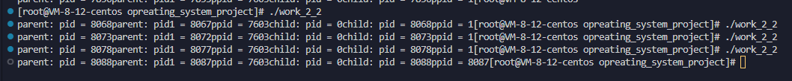
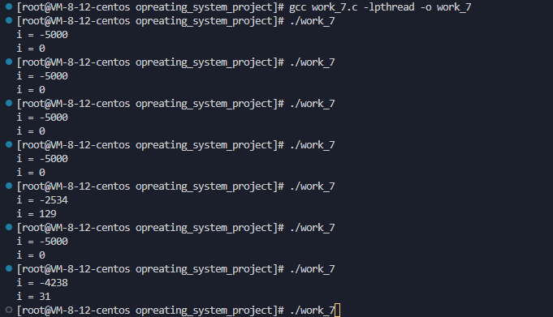
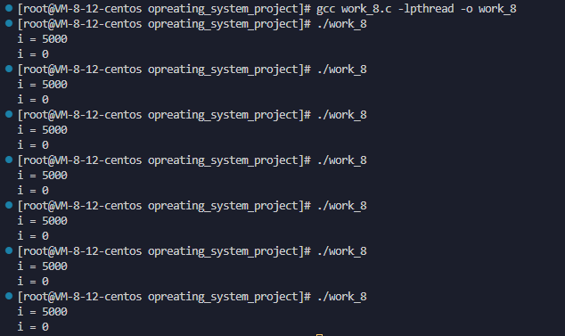
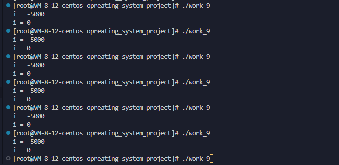
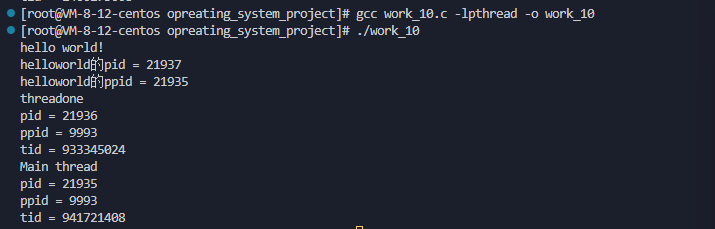
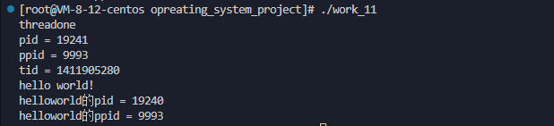

# 操作系统第一次实验

----------------

## 进程部分

------------

### 实验过程：

(1)第一步:
将课本上图3-32程序代码原封不动地写在程序work_1.c中, 通过linux中gcc命令进行编译并运行:  

```
    gcc work_1.c -o work_1
    ./work_1
```

fork()函数会给父进程返回子进程号，而给子进程返回0，进程号输出如下几张图。
最开始我是使用课本原本的代码运行，结果如下：

可以看出多次都是child进程先输出而后父进程输出
由于一开始有点看不习惯就把代码输出了换行符 '\n', 但是发现结果如下：


* 加上换行符后，结果居然变成了父进程先输出，后经过上网搜索发现，printf函数中如果没有加入结束符'\n'则不会直接输出，而是等进程结束后再输出，后仔细查看代码后发现，书上的代码相当与父进程使用wait函数等待子进程结束之后再结束进程，所以有了第一次的运行结果，而第二张图是由于父进程本身先运行导致父进程先执行printf而先输出！   
  
  于是之后使用work_2.c进行验证，work_2.c中把work_1.c中代码删除wait()函数，运行结果为：
  
  结果发现是父进程先结束，与上述想法一样，父进程先运行先结束，实际上此时的子进程就变成了所谓的孤儿进程？（父进程先结束而子进程还没有结束）
  于是尝试使用work_2_2.c验证父进程是否先结束，即return 0前面加一行父进程号的输出, 结果如下：
  
  但是发现子进程的ppid依然是父进程，说明父进程并没有结束，子进程并不是孤儿进程，考虑是不是进程加载速度的原因？
  随后再对work_2_2.c进行修改, 把wait(NULL)加在子进程尾部，发现输出如下:
  
  此时是父进程已经结束，而子进程变成孤儿进程，但是被挂在1号进程上，由于1号进程回收子进程资源,但是后面发现子进程中调用wait函数实际上是让子进程等待父进程，这样验证不正确。于是改成再子进程中加循环，让子进程更慢结束，发现子进程ppid有时候是父进程号，有时候是1号进程,这里就不太懂了，不知道父进程return后到底有没有结束，无法理解。个人猜想是父进程return后并没有马上结束，而是等待一段时间再结束，如果没有等到，则自行结束
  
  查找期间发现两个概念为僵尸进程和孤儿进程：

* 孤儿进程即父进程先结束了子进程处于死循环中等等没有结束，导致父进程先结束，正如上面测试同理，然而这样问题比较小，因为linux系统会将子进程挂在1号初始进程中，让1进程回收（1进程永远不会结束）

* 僵尸进程即子进程结束但是父进程处于运行状态或者睡眠状态(两种S和D)等等，导致父进程无法回收子进程，则导致子进程无法释放，这样问题很大，子进程内容会一直存在
  
  (2) 第二步（扩展部分）

* 根据实验要求，添加一个全局变量并在父进程和子进程中对这个变量做不同操作，输出操作结果并解释，同时输出两种变量的地址观察并分析；于是在work_3.c中加入全局变量int i = 0，同时为了输出结果方便阅读，将程序中printf中均加了换行符，在父进程操作后加了wait()函数保证子进程一定比父进程先结束（安全),输出结果如下：
    
  结果分析如下：
  可以看出fork()之后子进程继承了父进程的各种资源，比如全局变量i, 可以明显通过父子进程操作(i--和i++)和输出看出父子进程中i是两个变量，相当于是父进程子进程各对自己进程的i变量进行操作，互不干扰
  而对于地址来说，两个i的虚拟地址相同，但从输出结果来看两个i并不是存储在同一位置的i，查阅后发现，是os的内存管理机制，让虚拟地址虽然相同但却映射到不同的物理地址上

* 根据实验要求，在return前增加对全局变量的操作并输出结果，同时在return前加了对i的操作（i--，为了父子进程区分)和输出, 输出结果如下:
  
  结果分析如下:
  return前操作为i--, 父进程在else代码块中等待子进程结束的信号，所以子进程先运行到return，所以先输出子进程的i=0(子进程中i=1),后父进程收到信号后继续运行，所以后输出父进程的i=-2(父进程中i=-1)

* 根据实验要求，修改程序体会在子进程中调用system函数和在子进程中调用exec族函数执行自己写的一段程序
  
  1. 自己写的程序helloworld如下:
     
     ```c
     #include<stdio.h>
     #include <unistd.h>
     int main(){
        printf("hello world!\n");
        printf("helloworld中pid = %d\n", getpid());
        printf("helloworld的ppid = %d\n", getppid());
        return 0;
     }
     ```
  
  2. 使用system函数
     即work_5.c, 其中使用system('./helloworld')来调用helloworld程序，写在子进程else代码块中，输出结果如下:
     
     结果分析如下：
     可以看出system调用后，依然是继续执行子进程，而不是覆盖子进程运行(子进程后面输出了"是否运行？")，实际上system函数相当于fork()+exec()，并不会覆盖子进程，而是创建新的子进程(输出中被调用进程的ppid为原进程id)并用exec覆盖运行，运行结束回到原进程继续运行
     
     2. 使用exec族函数
        即work_6.c, 其中使用execv函数执行已经编译好的helloworld代码
        输出结果如下：
        
        结果分析如下：
        可以看出调用helloworld程序后，helloworld的进程号为子进程进程号, 父进程号为原本的父进程进程号，即exec族函数是将调用的程序覆盖子进程运行(work_6.c在调用后又有一行输出，但是并没有输出)

-----------

## 线程部分

---------------------------------

### 预备知识：

对于含有线程的程序，要编译需使用如下命令:

```bash
gcc work_7.c -lpthread -o work_7
./work_7
```

要使用线程需要:

```c
#include<pthread.h>
```

函数介绍:

```c
pthread_create(pthread_t* idpoint, NULL, (void*)function, input)
///课本上介绍了软件实现线程主要是以调用函数的方式进行，所以该函数几个项分别是
///第一项是线程id地址，第二项为线程属性(一般为NULL),第三项为函数地址
///第四项为函数输入值
pthread_join(pthread_t id, NULL)
///主要是用来结束线程,第一项为线程id号,第二项为储存线程结束状态，即储存线程函数
///return值
pthread_mutex_t mutex; //定义互斥信号量的方法
pthread_mutex_init(pthread_mutex_t* mutexpoint, NULL)//对互斥信号量初始化
//第一个参数为信号量的地址，第二参数为属性，一般为NULL
pthread_mutex_destroy(pthread_mutex_t* mutexpoint);//摧毁互斥信号量
//init实际上是一个类似malloc的过程，需要destroy函数来进行摧毁，进程结束并不会释放
pthread_mutex_lock(&mtx);
//获取锁
pthread_mutex_unlock(&mtx);
//释放锁
```

### 实验过程：

* 在进程中给一变量赋初值并创建两个线程；

* 在两个线程中分别对此变量循环五千次以上做不同的操作并输出结果 ；

* 多运行几遍程序观察运行结果;
  
  于是编写程序work_7.c,输出结果如下:
  
  
  
  结果分析：
  
  创建线程后两个线程同时对i变量进行操作（线程之间共享数据区)，由于同时操作，就无法确定同一时刻是哪个线程在运行操作，就会出现第五个和第七个的输出结果
  
  会这样的原因是此时i是互斥资源,应该对i做互斥，于是程序修改如work_8.c,输出结果如下:
  
  
  结果分析：
  
  实际上是通过改变函数pthread_join的位置来实现的，是通过确认两个线程的同步关系，来保证i只有一个线程在操作。通过输出关系来看实现成功
  
  同时使用互斥锁尝试，修改代码为work_9.c，输出结果如下:
  
  
  
  结果分析：
  
  使用了互斥锁，让对i的操作和输出变为临界区资源，让其只能同一时刻只有一个线程操作5000次，也实现了实验目标

* 将任务一中第一个实验调用system函数和调用exec族函数改成在线程中实现，观察运行结果输出进程PID与线程TID进行比较并说明原因
  
  于是编写代码work_10.c，使用system函数调用helloworld，输出结果如下:
  
  
  
  结果分析：
  
  在子线程中调用函数，结果helloworld进程ppid为原进程的pid，这个合理，但是threadone的pid竟然和原本进程不一样，ppid为两个线程共同的父进程号，经过查阅资料发现，linux中的线程是通过进程模拟而来，所以新建线程实际上是新建了一个进程，对资源共享等等是模拟而来。tid为正常情况
  
  编写代码work_11.c，使用execv函数调用helloworld，输出结果如下：
  
  
  
  结果分析：
  
  * 可以看出ppid仍为9993，可能9993的进程专门用来线程模拟（多次运行父进程均为9993)
  
  * 分析下面的代码可以看出，调用execv后，对下面的线程也覆盖，让整个进程被helloworld覆盖运行，符合线程原理，多线程处于同一个进程中。但实际上threadone的进程号应该和原进程不一样，所以覆盖运行也是模拟而来。（也许是通过返回原进程进程号而实现;可以从helloworld的父进程变为9993看出是模拟而来)
  
  * tid为正常情况
  
  ### 实验感想：
  
  * 书上的原理是一套，但是实际上操作系统怎么实现而各有区别。
  
  * 原理和实践结合，让我对操作系统有了更深的理解